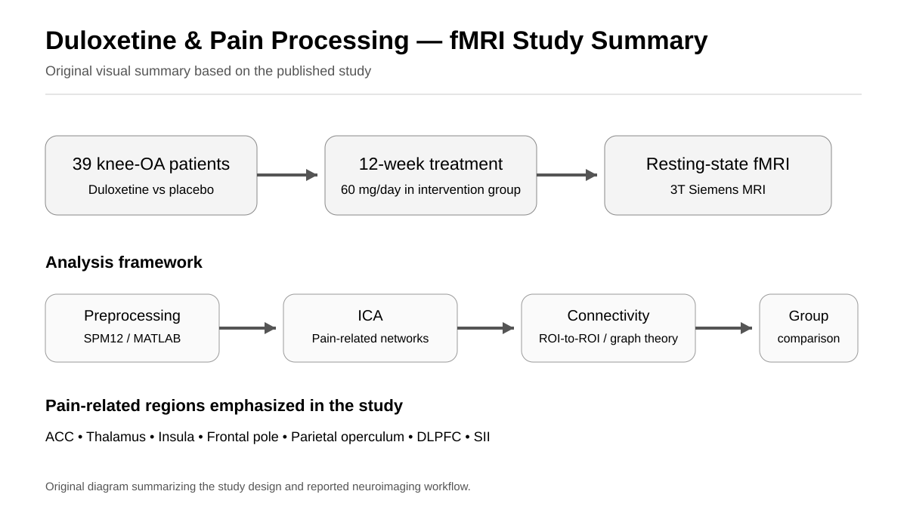

# fMRI-Duloxetine-Pain-Networks

## The Effect of Duloxetine on Brain Neural Activity and Pain Processing in Patients with Knee Osteoarthritis: An fMRI-Based Study



*Original visual summary based on the published study.*

This repository presents a research project investigating the effects of duloxetine on brain neural activity and pain processing in patients with knee osteoarthritis using functional magnetic resonance imaging (fMRI).

The study focused on changes in pain-related brain networks and functional connectivity following duloxetine treatment.

## Research Question

How does duloxetine treatment affect brain neural activity and pain-related functional connectivity in patients with knee osteoarthritis?

## Study Focus

- Knee osteoarthritis
- Chronic pain
- Duloxetine
- Functional magnetic resonance imaging (fMRI)
- Resting-state fMRI
- Pain processing
- Brain connectivity
- Functional connectivity
- Brain networks

## Study Design

The study included 39 patients with knee osteoarthritis.

Participants received duloxetine or placebo treatment for 12 weeks. The duloxetine group received 60 mg/day of duloxetine.

Resting-state fMRI data were acquired using a 3 Tesla Siemens Trio MRI scanner.

## fMRI Analysis

The fMRI data were analyzed using MATLAB-based neuroimaging tools.

The analysis included:

- Independent Component Analysis (ICA)
- ROI-to-ROI functional connectivity
- Graph theory analysis
- Permutation testing
- False Discovery Rate (FDR) correction

The analysis investigated pain-related brain regions and their functional interactions.

## Regions and Networks of Interest

The analysis included pain-related regions and networks involving:

- Anterior cingulate cortex (ACC)
- Thalamus
- Insular cortex
- Frontal pole
- Parietal operculum
- Anterior insular cortex
- Parietal cortex
- Dorsolateral prefrontal cortex
- Secondary somatosensory cortex

## Research Workflow

```text
Knee Osteoarthritis Patients
        ↓
Duloxetine / Placebo Treatment
        ↓
Resting-State fMRI
        ↓
Preprocessing
        ↓
Independent Component Analysis
        ↓
ROI-to-ROI Functional Connectivity
        ↓
Graph Theory Analysis
        ↓
Statistical Testing
        ↓
FDR Correction
        ↓
Pain-Related Brain Network Analysis
```

## Software and Tools

- MATLAB
- SPM12
- CONN
- Independent Component Analysis
- Graph Theory

## Publication

Chaghazardi, Y., Faramarzi, A., Dehlaghi, V., Jalalvandi, M., Khodamoradi, E., Yousef Pour, M., & Sharini, H. (2025).

**The Effect of Duloxetine on Brain Neural Activity and Pain Processing in Patients with Knee Osteoarthritis: An fMRI-Based Study.**

*Isfahan Medical School Journal, 43*(817), 574–581.

- [Read the article](https://jims.mui.ac.ir/article_33018.html)
- [PDF](https://jims.mui.ac.ir/article_33018_ebf51cc89fabd1246021aa123704d1bd.pdf)
- [DOI](https://doi.org/10.48305/jims.v43.i817.0574)

## Author

**Ayob Faramarzi**

Biomedical Engineering | Neuroimaging | fMRI | MRS | Brain Connectivity | Machine Learning

[Google Scholar](https://scholar.google.com/citations?hl=en&user=1uivc_4AAAAJ)

[LinkedIn](https://www.linkedin.com/in/ayob-faramarzi/)
